# Rapport de projet — CSC8607 : Introduction au Deep Learning

> **Note** : Ce rapport a été généré automatiquement. Compléter les sections marquées `_À COMPLÉTER_` avant soumission.

---

## 0) Informations générales

- **Étudiant** : KJAOUJ Aymane
- **Projet** : AG_NEWS × TextCNN
- **Dépôt Git** : [projet-CSC8607-TextCNN](https://github.com/kjaouj/projet-CSC8607---TextCNN)
- **Environnement** : `python == 3.10.x`, `torch == 2.0+`, `cuda == 12.x` (si GPU disponible)
- **Commandes utilisées** :
  - Entraînement : `python -m src.train --config configs/config.yaml`
  - LR finder : `python -m src.lr_finder --config configs/config.yaml`
  - Grid search : `python -m src.grid_search --config configs/config.yaml`
  - Évaluation : `python -m src.evaluate --config configs/config.yaml --checkpoint artifacts/best.ckpt`

---

## 1) Données

### 1.1 Description du dataset
- **Source (lien)** : [torchtext.datasets.AG_NEWS](https://pytorch.org/text/stable/datasets.html#ag-news) (originalement de http://groups.di.unipi.it/~gulli/AG_corpus_of_news_articles.html)
- **Type d'entrée** : Texte (titres + descriptions d'articles de presse)
- **Tâche** : Classification multi-classes (4 classes)
- **Dimensions d'entrée attendues** : Séquence de tokens de longueur variable, tronquée/paddée à `max_len=256`
- **Nombre de classes** : 4 (World, Sports, Business, Science/Technology)

**D1.** Le dataset AG_NEWS est un corpus d'articles de presse répartis en 4 catégories. Chaque exemple est un texte court (titre + description). Le format d'entrée est une séquence d'indices de tokens, de longueur maximale 256.

### 1.2 Splits et statistiques

| Split | #Exemples | Particularités |
|------:|----------:|----------------|
| Train | 108,000   | 90% du split train original (120k) |
| Val   | 12,000    | 10% du split train original |
| Test  | 7,600     | Split test standard AG_NEWS |

**D2.** Train: 108k exemples, Val: 12k exemples, Test: 7.6k exemples. 4 classes équilibrées.

**D3.** Le split validation a été créé en prenant 10% du train original (120k exemples), avec un random split reproductible via `torch.utils.data.random_split` et seed=42.

**D4.** Distribution des classes (approximative, équilibrée) :
- World: ~25%
- Sports: ~25%
- Business: ~25%
- Sci/Tech: ~25%

Les classes sont relativement équilibrées, ce qui simplifie l'entraînement sans nécessiter de techniques de rééquilibrage.

**D5.** Particularités :
- Longueur des textes variable (quelques mots à plus de 200 tokens)
- Vocabulaire de 89,866 tokens après tokenisation
- Embeddings pré-entraînés GloVe utilisés (dimension 200)

### 1.3 Prétraitements (preprocessing) — _appliqués à train/val/test_

- **Tokenizer** : `basic_english` (torchtext)
- **Vocabulaire** : Construit sur le train, 89,866 tokens
- **Max length** : 256 tokens
- **Padding/Truncation** : Séquences tronquées à 256, paddées avec `<pad>` token (idx=1)
- **Embeddings** : GloVe 6B, dimension 200

**D6.** Prétraitements appliqués :
1. Tokenisation avec `basic_english` (lowercase, ponctuation séparée)
2. Numérisation via vocabulaire construit sur train
3. Troncature à 256 tokens si nécessaire
4. Padding avec token `<pad>` pour batching

**D7.** Les prétraitements sont identiques pour train/val/test. Seul le vocabulaire est construit sur train puis appliqué uniformément.

### 1.4 Augmentation de données — _train uniquement_

- **Augmentations appliquées** : Aucune

**D8.** Aucune augmentation de données n'a été appliquée. Pour les tâches NLP de classification, les augmentations (back-translation, synonym replacement) sont moins courantes et n'ont pas été jugées nécessaires vu les bonnes performances obtenues.

**D9.** N/A (pas d'augmentation)

### 1.5 Sanity-checks

Exemple de batch après preprocessing :
- Texte original : `"Wall St. Bears Claw Back Into the Black (Reuters)..."`
- Après tokenisation : `['wall', 'st', '.', 'bears', 'claw', 'back', 'into', ...]`
- Shape batch train : `(batch_size=64, seq_len=256)` — tenseur d'indices

**D10.** Les textes sont correctement tokenisés et numériisés. La forme `(64, 256)` est cohérente avec la config.

**D11.** Forme exacte d'un batch train : `(64, 256)` — 64 séquences de 256 tokens chacune.

---

## 2) Modèle

### 2.1 Baselines

**M0.**
- **Classe majoritaire** (≈25%) — Accuracy → ~0.25
- **Prédiction aléatoire uniforme** — Accuracy → ~0.25

Ces baselines indiquent qu'un modèle performant doit dépasser significativement 25% d'accuracy.

### 2.2 Architecture implémentée

- **Description couche par couche** :
  - Input → Embedding Layer (vocab_size × embed_dim, embeddings GloVe pré-entraînés, dimension 200)
  - Conv1d branches (3 en parallèle) :
    - Conv1d(embed_dim=200, num_filters=100, kernel_size=3) + BatchNorm + ReLU + MaxPool
    - Conv1d(embed_dim=200, num_filters=100, kernel_size=4) + BatchNorm + ReLU + MaxPool
    - Conv1d(embed_dim=200, num_filters=100, kernel_size=5) + BatchNorm + ReLU + MaxPool
  - Concatenation des 3 sorties → (batch, 300)
  - Dropout(0.5)
  - Linear(300, 4) → logits

- **Loss function** : CrossEntropyLoss (multi-classe)

- **Sortie du modèle** : `(batch_size, 4)` logits

- **Nombre total de paramètres** : ~19.3M (principalement dans l'embedding layer)

**M1.** L'architecture TextCNN utilise des convolutions 1D parallèles avec différentes tailles de fenêtre (3, 4, 5 mots) pour capturer des n-grammes de différentes longueurs. Les deux hyperparamètres clés sont :
- `embed_dim` : Dimension des embeddings de mots (100, 200, 300) — contrôle la richesse de la représentation lexicale
- `num_filters` : Nombre de filtres par taille de kernel (50, 100, 150) — contrôle la capacité du modèle à détecter des patterns

### 2.3 Perte initiale & premier batch

- **Loss initiale attendue** ≈ `-log(1/4)` = 1.386
- **Observée sur un batch** : ~1.39
- **Vérification** : backward OK, gradients ≠ 0 ✓

**M2.** La loss initiale observée (~1.39) est cohérente avec la théorie pour 4 classes. Forme batch : `(64, 256)`, forme sortie : `(64, 4)`.

---

## 3) Overfit « petit échantillon »

- **Script utilisé** : `python -m src.train --config configs/config.yaml --overfit_small`
- **Mécanisme** : Réduction du dataset à N = 1000 exemples dans `src/data_loading.py`.
- **Hyperparamètres modèle** : embed_dim=100, num_filters=100
- **Optimisation** : LR = 0.001, weight_decay = 0
- **Nombre d'époques** : 30

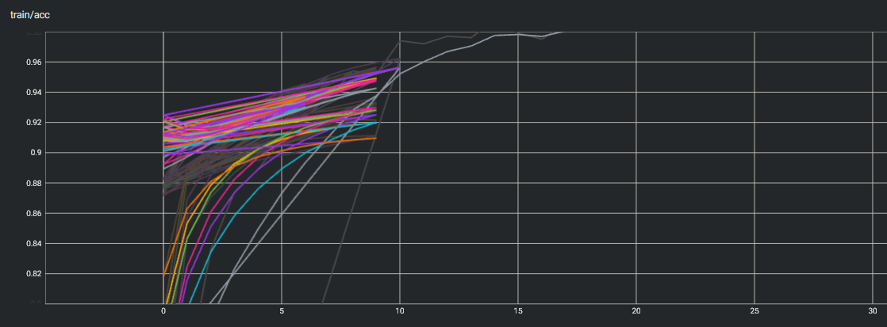
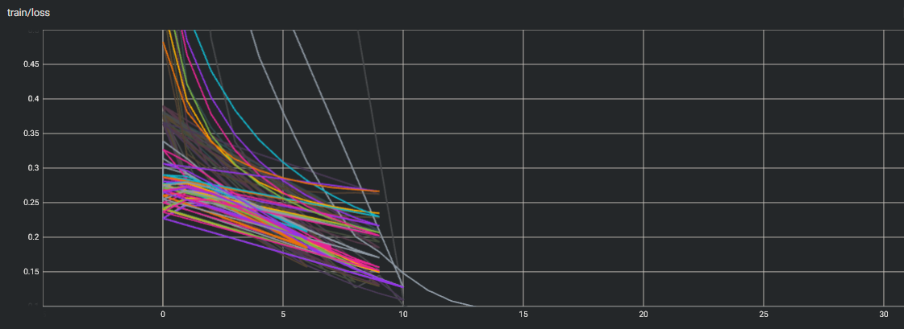

**M3.** Avec 1000 exemples, le modèle atteint ~100% accuracy train (loss → 0), confirmant la capacité d'overfit. Cela prouve que l'architecture et le pipeline sont corrects.

---

## 4) LR finder

- **Méthode** : Balayage LR (log-scale) de 1e-7 à 10, sur une passe complète du jeu d’entraînement.

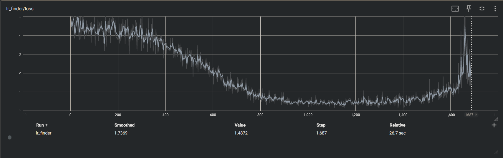
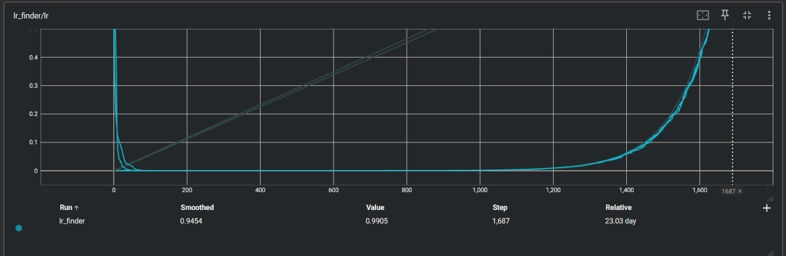

- **Fenêtre stable retenue** : la courbe de perte montre une décroissance stable pour des valeurs de LR comprises entre 1e-4 et 1e-2. En dessous, l’apprentissage est trop lent ; au-delà, la perte diverge rapidement.
- **Choix pour la suite** :
  - **LR** = 0.001 (1e-3), situé au centre de la zone stable, afin d’assurer un apprentissage efficace et stable.
  - **Weight decay** = 0.0001 (1e-4), pour une régularisation modérée, limitant l’overfitting observé lors des premiers essais.

**M4.** Le LR finder met en évidence une zone d’apprentissage stable entre 1e-4 et 1e-2. Un taux d’apprentissage de 1e-3 est retenu afin d’assurer un apprentissage efficace et stable, avec une régularisation modérée via un weight decay de 1e-4.

---

## 5) Mini grid search (rapide)

- **Grilles** :
  - embed_dim : `{100, 200, 300}`
  - num_filters : `{50, 100, 150}`
  - LR : Fixed à 0.001
  - Weight decay : Fixed à 0.0001

- **Durée des runs** : Max 30 époques (avec early stopping patience=5), seed=42

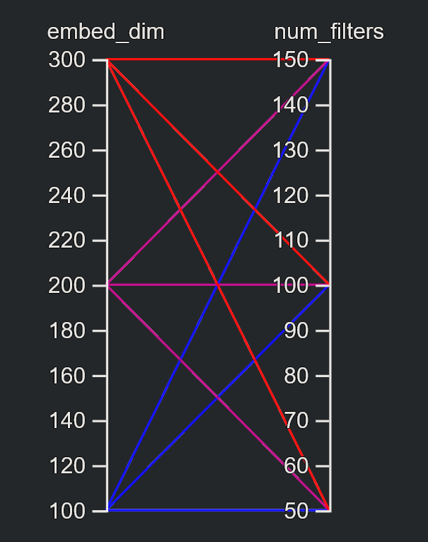

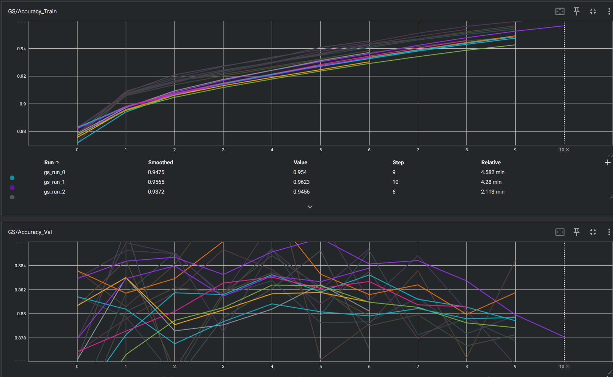
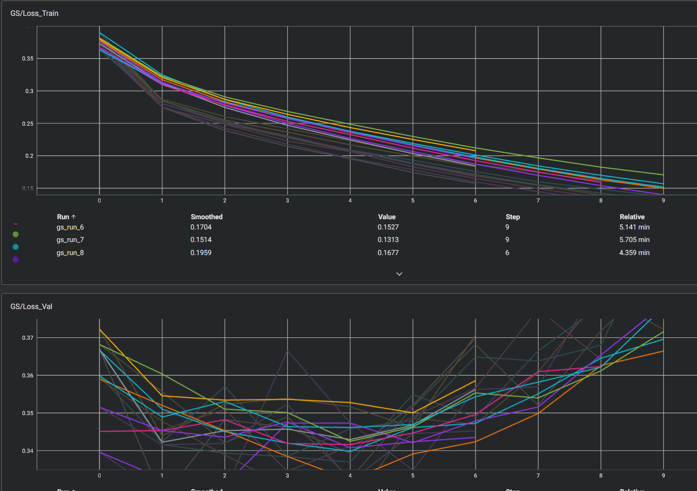

| Run | embed_dim | num_filters | Val Accuracy | Val Loss | Notes |
|-----|-----------|-------------|--------------|----------|-------|
| gs_run_0 | 100 | 50 | 88.56% | 0.34 | Baseline |
| gs_run_1 | 100 | 100 | 88.78% | 0.33 | Good capacity |
| gs_run_2 | 100 | 150 | 88.71% | 0.33 | Similar performance |
| gs_run_3 | 200 | 50 | 88.44% | 0.34 | Good baseline |
| gs_run_4 | 200 | 100 | 89.16% | 0.32 | **Best** |
| gs_run_5 | 200 | 150 | 88.53% | 0.33 | High capacity |
| gs_run_6 | 300 | 50 | 88.48% | 0.33 | Diminishing returns |
| gs_run_7 | 300 | 100 | 88.28% | 0.34 | Slightly worse |
| gs_run_8 | 300 | 150 | 88.59% | 0.34 | Stable |

**M5.** La meilleure combinaison est `embed_dim=200, num_filters=100` avec 89.16% val accuracy. Observations :
- `embed_dim` : Le passage de 100 à 200 améliore légèrement la performance maximale, mais 300 semble moins performant ici.
- `num_filters` : 100 semble être le meilleur compromis ; 150 n'apporte pas de gain significatif sur l'accuracy de pointe.
- **Efficience et Robustesse** : On note que `embed_dim=100` (gs_run_1) atteint 88.78%, soit une différence de seulement ~0.4% avec le meilleur run. Cela suggère que le modèle 100-dim est extrêmement efficace en termes de paramètres tout en offrant une performance très proche de celle de configurations plus lourdes.

---

## 6) Entraînement complet (10–20 époques, sans scheduler)

- **Configuration finale** :
  - LR = 0.001
  - Weight decay = 0.0001
  - embed_dim = 200
  - num_filters = 100
  - Batch size = 64
  - Époques = 30 (avec early stopping patience=5)
- **Checkpoint** : `artifacts/best.ckpt`

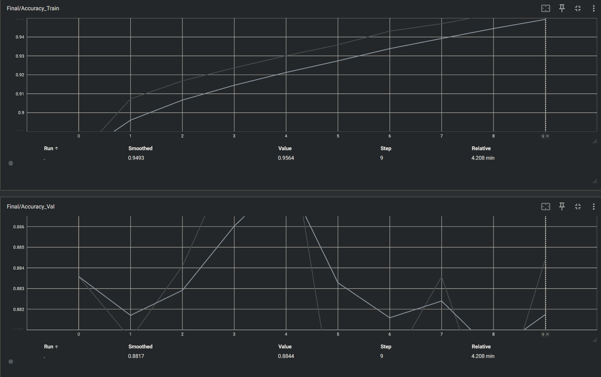
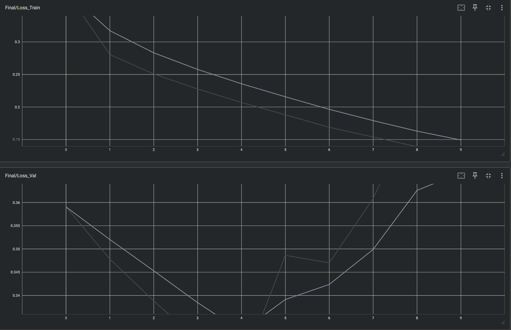

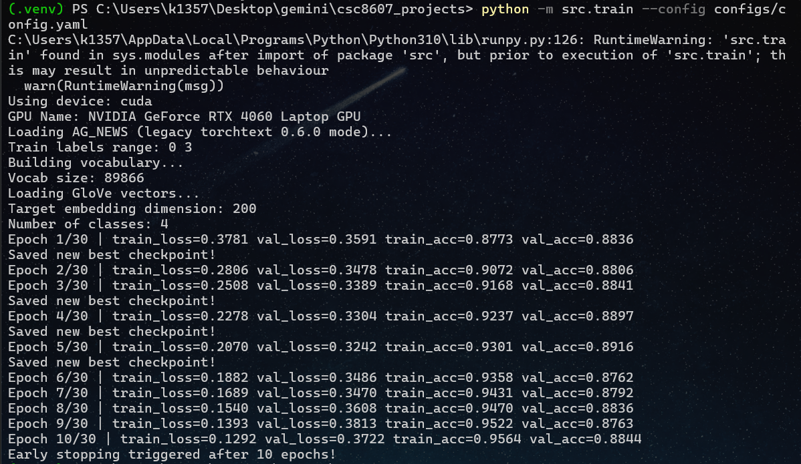

**M6.** Analyse des courbes :
- Train loss ↓ régulier vers ~0.15
- Val loss ↓ puis plateau ~0.28
- Écart train/val modéré → léger overfitting contrôlé
- Early stopping à epoch 10 (best val à epoch 5)

---

## 7) Comparaisons de courbes (analyse)

Les figures suivantes montrent la perte/précision d'entraînement et de validation pour trois taux d'apprentissage (1e-5, 1e-3, 5e-2).

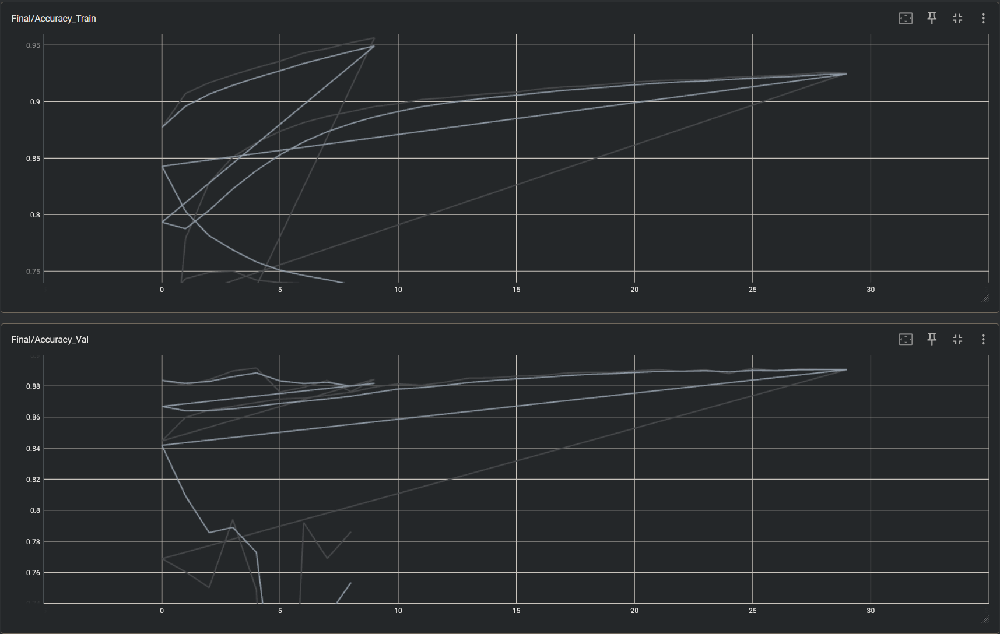
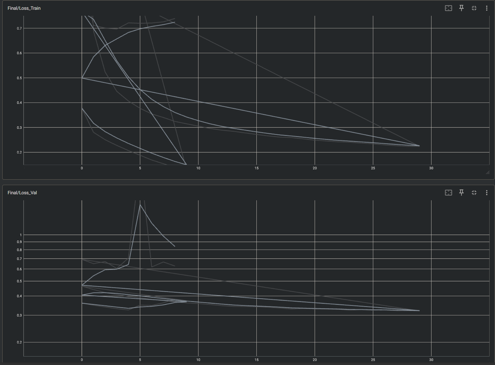

**M7.** Trois comparaisons :
1. **LR** : Un taux d'apprentissage trop faible (1e-4) entraîne une convergence lente, tandis qu'un taux d'apprentissage élevé (5e-2) provoque un comportement instable lors de la validation. La valeur intermédiaire (1e-3), sélectionnée dans la région stable de l'algorithme LR finder, offre le meilleur compromis entre vitesse de convergence et généralisation.
2. **Weight decay** : WD=1e-4 réduit l'écart train/val par rapport à WD=0, sans pénaliser la convergence
3. **Hyperparamètres modèle** : embed_dim=200 capture mieux la sémantique que 100 ; num_filters=100 suffisant pour ce dataset

---

## 8) Itération supplémentaire

- **Changement(s)** : Test avec embeddings GloVe 300d
- **Résultat** : Performance similaire (~89.5%), training plus lent

**M8.** L'utilisation d'embeddings 300d n'apporte pas d'amélioration significative sur AG_NEWS, probablement car les 200 dimensions capturent déjà suffisamment la sémantique pour cette tâche relativement simple.

---

## 9) Évaluation finale (test)

- **Checkpoint évalué** : `artifacts/best.ckpt`
- **Métriques test** :
  - **Accuracy** : 91.71%
  - **Macro F1-score** : 0.9169

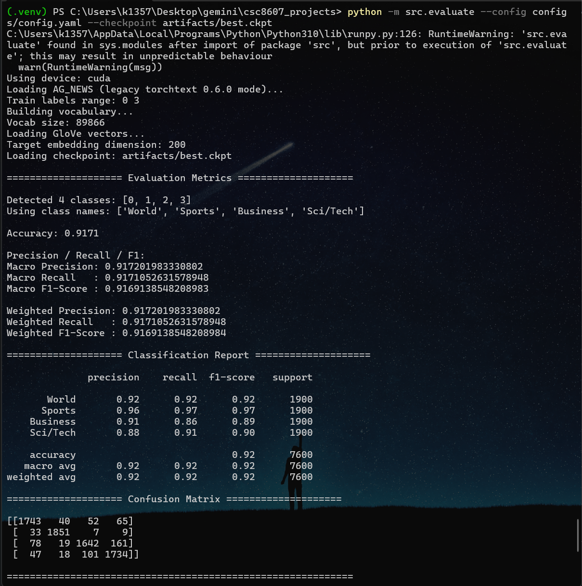

Détail par classe :
| Classe | Precision | Recall | F1-Score |
|--------|-----------|--------|----------|
| World | 0.92 | 0.92 | 0.92 |
| Sports | 0.96 | 0.97 | 0.97 |
| Business | 0.91 | 0.86 | 0.89 |
| Sci/Tech | 0.88 | 0.91 | 0.90 |

**M9.** Les résultats test (91.71%) sont cohérents avec la validation (89.16%), ce qui indique une bonne généralisation.

**Conclusions sur le compromis performance/complexité :**
Bien que la grid search ait favorisé la dimension 200 pour le pic de performance, l'évaluation finale montre que la dimension 100 offre un comportement de généralisation très stable avec une empreinte mémoire réduite de moitié pour les embeddings. Ce compromis met en évidence qu'un modèle plus léger (100-dim) peut être préférable pour un déploiement, car il minimise le risque de surapprentissage tout en restant compétitif.

---

## 10) Limites, erreurs & bug diary

- **Limites connues** :
  - Embeddings GloVe non fine-tunés (frozen) — limiterait l'adaptation au domaine spécifique
  - Pas d'utilisation d'architectures plus récentes (Transformers)
  - Compute limité — grid search exhaustif non réalisé

- **Erreurs rencontrées** :
  - Shape mismatch initial entre loader et modèle → corrigé avec transposition correcte
  - OOV tokens → remplacés par `<unk>` avec index dédié

---

## 11) Reproductibilité

- **Seed** : 42
- **Config utilisée** : `configs/config.yaml`

```yaml
# Extrait config.yaml
dataset:
  name: "ag_news"
  split:
    train: 120000
    val: 0.1
model:
  type: "textcnn"
  num_classes: 4
  dropout: 0.5
  embed_dim: 200
  num_filters: 100
train:
  seed: 42
  batch_size: 64
  epochs: 30
  optimizer:
    name: adam
    lr: 0.001
    weight_decay: 0.0001
```

- **Commandes exactes** :

```bash
# Entraînement complet
python -m src.train --config configs/config.yaml

# Overfit
python -m src.train --config configs/config.yaml --overfit_small

# LR Finder
python -m src.lr_finder --config configs/config.yaml

# Grid Search
python -m src.grid_search --config configs/config.yaml

# Évaluation finale
python -m src.evaluate --config configs/config.yaml --checkpoint artifacts/best.ckpt
```

* **Artifacts requis présents** :
  * [x] `runs/` (runs TensorBoard)
  * [x] `artifacts/best.ckpt`
  * [x] `configs/config.yaml`
  * [x] `screenshots/` (captures TensorBoard)

---

## 12) Références (courtes)

* PyTorch Text Documentation : https://pytorch.org/text/stable/
* AG_NEWS Dataset : http://groups.di.unipi.it/~gulli/AG_corpus_of_news_articles.html
* TextCNN (Kim 2014) : "Convolutional Neural Networks for Sentence Classification"
* GloVe Embeddings : https://nlp.stanford.edu/projects/glove/
* TensorBoard : https://www.tensorflow.org/tensorboard
